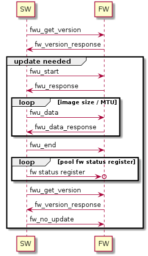

1. Introduction
----------------

The The Intel Graphics System Firmware Update Library (IGSC FUL) is
a pure C low level library that exposes a required API
to perform a firmware update of a particular Intel discrete
graphics device. The library utilized a cross platform library `metee`_ in
order to access the GSC (mei) device. GSC device is an extension of the
Intel discrete graphics device (dGFX).

The library can update GSC firmware itself, and as well as OPROM VBT
and the code (VBIOS, GOP).

The library provides retrieval of identity and version information from
both graphic device and supplied firmware or OPROM image as well as
function for firmware update of those images to the device.

.. _metee: https://github.com/intel/metee

1.2. GSC Firmware
~~~~~~~~~~~~~~~~~~

GSC Firmware is a firmware running on the graphics system controller.
It is responsible for system configuration, such as memory training
loading of other firmware components, as well as content protection
settings.

1.3 OPROM
~~~~~~~~~

An expansion ROM / option ROM is a firmware that resides on a PCIe device,
can be read by the host device and used to initialize or boot the device.
In Intel discrete graphics cards, the option ROM has two main roles:

  * Allows BIOS to use the display of the device – this is only relevant for
    platforms that use the card as their primary display.

  * Stores the VBT (Video BIOS table) – this is the table that holds the device
    specific display related manufacturing configurations.
    This data is used by both the option ROM and the dGFX driver.

1.4. GSC Firmware Interface Device
~~~~~~~~~~~~~~~~~~~~~~~~~~~~~~~~~~~

GSC Firmware Interface is a child device of dGFX and provide a dedicated
interface to GSC Firmware.  The interface is handled on Windows via
Intel Graphics System Controller Firmware Interface driver no Linux
this is via MEI driver with MEI GSC driver module available in the Linux kernel.

1.5. Firmware update flow
~~~~~~~~~~~~~~~~~~~~~~~~~~

An application performing firmware or OPROM update opens a handle to the GSC FI
driver associated with a GFX device. The application retrieves version and
other identity information from the device. Second, it will load the supplied
firmware image and retrieves same information from the loaded image.
Third, the application performs identity matching and version comparison
to verify that the firmware is suitable for the device and version is desired.
Last it performs the actual update of the firmware.

The actual validation of the suitable firmware or OPROM image is done and
enforced by GSC Firmware and not by the library or application. However the
library enables some of those checks to be done prior to writing to device.

1.5.1 GSC Firmware Update
^^^^^^^^^^^^^^^^^^^^^^^^^

   GSC partition update flow

1. The library parses update image, extracts the “image metadata” section
   (FPT “INFO” entry) and sends it as part of a `fwu start` message

2. The FW receives the message and responds with OK if the update is allowed,
   or an error otherwise.  The FW sets progress bit in firmware status
   register 1 `FWSTS1`

3. The Library starts sending chunks of the update image using the `fwu data`
   massage. The FW responds with a return value indicating if the operation
   was successful. The return value of the last chunk will also indicate if
   full verification of the update image was successful.

   .. Note:: The response to the first and last chunk takes longer.

4. Finally, the library sends a `fwu end` message. Upon receiving this message,
   the FW will move to phase 2. There is no response to that message .

5. The start to pools `FWSTS1` on `completion` bit and `fw update state` bit,
   while firmware perform additional step and reboots. When the `completion` bit
   is set and `fw udate state` is idle the process has completed.
6. The library queries for firmware version again and verifies that the new
7. The library sends `fw no update` message.

1.5.2 OPROM Update
^^^^^^^^^^^^^^^^^^^

The following basic checks are performed on the image.

1. *Image correctness:*

   As the most basic check both the library and the firmware validates the correctness,
   of the image layout. The level of validation differs and the library
   parsing is more coarse.

2. *Security Verification:*.

   This check is only performed by firmware, the library doesn't have secure
   access to the required certificates.

3. *Security Version Number (SVN).:*

   The firmware doesn't allow image downgrade, meaning if SVN of the update image
   is smaller then on already present in the partition. SVN stored in the device flash
   it is not accessible to the library hence this check is firmware only.

4. *Production bit (PV).*

   The firmware use this bit to prevent pre-production ORPOM downgrade.

5. *Image version:*

   Firmware doesn't compare the firmware version but the library
   is capable of providing information to update process weather it
   is update, downgrade or override by the same version.

6. *Sub vendor and sub device id (SVID SDID)*.

   SVID and SDID from the graphics device PCI header must be on the list of
   supported devices in the OPROM image, this is required for correct
   board and vendor identification, the check is performed by firmware and the
   library.

1.5. Device enumeration
~~~~~~~~~~~~~~~~~~~~~~~

In order to enable firmware update of all devices in the system,
the library supports enumeration of graphics devices that are
subject to firmware and OPROM update. This is done by querying
the device via OS system API, the library provide a cross
platform (Windows/Linux) API. The enumeration API is not required
but recommended part of the flow, some applications such us
`fwupd`_ provide their own enumeration API.

.. _fwupd: https://github.com/fwupd/fwupd

1.6. Integrations
~~~~~~~~~~~~~~~~~

  1. On Linux client platforms the library integrates with fwupd.org
     daemon via *igsc plugin. The *fwupd* daemon is commonly an integral part
     on modern Linux distributions.
  2. On servers platforms the library might be integrated with BMC based solution.

1.7. Command Line Interface
~~~~~~~~~~~~~~~~~~~~~~~~~~~~

The project supplies sample command line tool that support firmware and
OPROM update. It's a simple cross platform utility.

